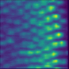
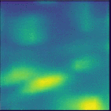
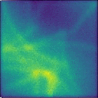
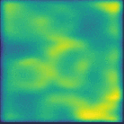
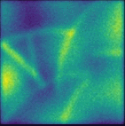
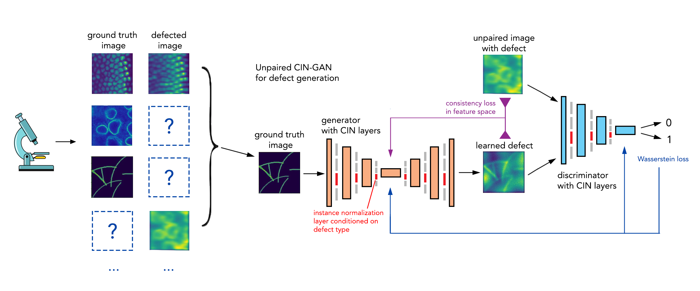
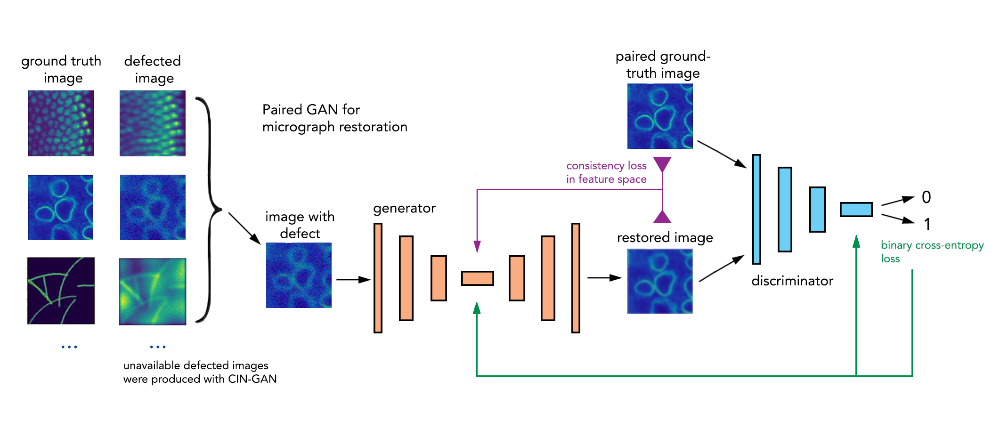
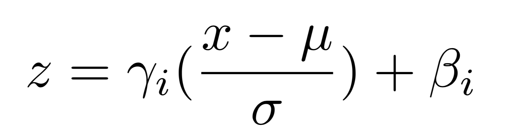
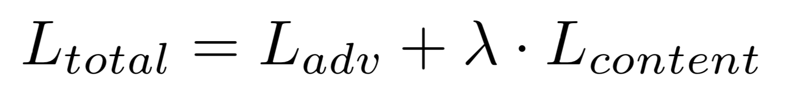

# MicroscopyGAN
Multi-defect microscopy image restoration under limited data conditions

This is Keras implementation of the paper <a href='http://arxiv.org/abs/1910.14207'>"Multi-defect microscopy image restoration under limited data conditions"</a> (A. Razdaibiedina, J. Velayutham, M. Modi). Rated in **Top-15 NeurIPS Medical Imaging workshop papers 2019**.

Restoration results of several microscopy defect types is shown below: <br/>
     

You can also take a look at our poster here: <a href='https://github.com/arazd/MicroscopyGAN/blob/master/poster.pdf'>MicroscopyGAN poster</a>.

## Architecture 
Our pipeline consists of two GANs:
1. unpaired CIN-GAN that learns to **generate defects from limited data**
 <br/>
2. paired cGAN that **restores images with multiple defects**. This GAN is trained on paired dataset that was augmented by CIN-GAN from the previous step


### CIN-GAN
This part is inspired by <a href='https://arxiv.org/abs/1610.07629'>Conditional Instance Normalization for style transfer</a> proposed by Dumoulin et al. All layers of this GAN are shared for different defect types except for CIN layers, which are turned on / off depending on which type of defect is being synthesized. CIN layer is defined as following: <br/>


where i is the number of task, μ and σ are mean and the standard deviation of the input x.

We apply condition on the instance normalization for each defect type. GAN with CIN layers is trained to perform data augmentation using limited amount of unpaired ground-truth and defected images.

### cGAN
After the dataset is augmented by CIN-GAN, a conditional GAN is trained on paired high-resolution ground-truth images and defective images. The resulting cGAN is used to restore multiple types of microscopy defects. As a loss function for cGAN we used a combination of adversarial and content losses, where content loss measures image consistency in feature space of VGG16 model:<br/>



## Microscopy defect types
In this work we focus on three common tasks in microscopy image restoration: 
* denoising 
* axial inpainting 
* deep-learning-enabled super-resolution

We used baseline biological micrograph restoration datasets used in Nature Methods paper <a href='https://www.nature.com/articles/s41592-018-0216-7'>"Content-aware image restoration"</a>.

## How to run

Download the repo. Put the following numpy files to the folder with scripts - Drosophila_X.npy, Drosophila_Y.npy, Retina_X.npy, Retina_Y.npy, Synthetic_tubulin_tubules_X.npy, Synthetic_tubulin_tubules_Y.npy. Files that end with X.npy are defected microscopy images from different sources, and corresponding files that end with Y.npy are their paired high-quality images ("ground truth"). We provide a shortened version of those arrays in the data folder.

Alternatively, you can use your own .npy files with defected and ground truth image arrays. To do that modify lines 55-62 of train_cGAN.py.

### Running CIN-GAN

Run

```bash
python train_CIN_GAN.py --batch_size=100 --num_iters=3000 --num_gpu=2 
```
If you are running on one gpu, then put --num_gpu=1. You can also specify a folfer where you want your results to be saved with --dir=my_save_path. Once training has started, a folder named *CIN-GAN_results* will appear.


### Running cGAN

a) **If you're training paired cGAN from scratch**

Run

```bash
python train_cGAN.py --batch_size=100 --num_iters=3000 --num_gpu=2 --images_limit=50
```
You can vary images_limit to experiment with different limited data settings. For the paper we reported results for images_limit=10. 

Once training has started, a folder named *Microscopy_cGAN_results* will appear and training results will be saved there.


b) **If you're training cGAN on dataset augmented by CIN-GAN**

Run
```bash
python train_cGAN.py --cin_augment=True --alpha=0.3 --cin_generator_path=/CIN-GAN/generator.h5 --batch_size=100 --num_iters=3000 --num_gpu=2 --images_limit=50
```

Make sure you put flag --cin_augment=True and indicate a correct path to CIN-GAN generator that you want to use for defects synthesis. Flag --alpha stands for percentage of generated data that you want to add to the real data.

Once training has started, a folder named *Microscopy_cGAN_results_CIN_augm* will appear and training results will be saved there.

## Results

We compared performance of our restoration pipeline in two settings: A) a limited amount of real
paired images (defected + in-focus) are available; B) no real pairs are available, all defected pairs for
cGAN training were synthetically generated. 

Comparison of PSNR/SSIM scores between our cGAN restoration network with other
models with 10 paired images (top) or no paired data (bottom):
   
|                  | Denoising  | Axial inpainting | Super-resolution |
| ------------- | ------------- | ------------- | ------------- |
| CARE  | 21.6/**0.56**  | 12.8/0.29 | 14.1/0.20  |
| DeblurGAN  | 18.0/0.33  | 14.6/0.20  | 11.2/0.14  |
| Ours | **22.4**/**0.56** | **17.4**/**0.38** | **14.3**/**0.22** |
| ------------- | ------------- | ------------- | ------------- |
| CycleGAN | 21.3/0.49 | **15.3**/0.27 | **12.7**/**0.14** |
| Ours | **21.9**/**0.57** | 15.1/**0.32** | 8.9/0.07 |
